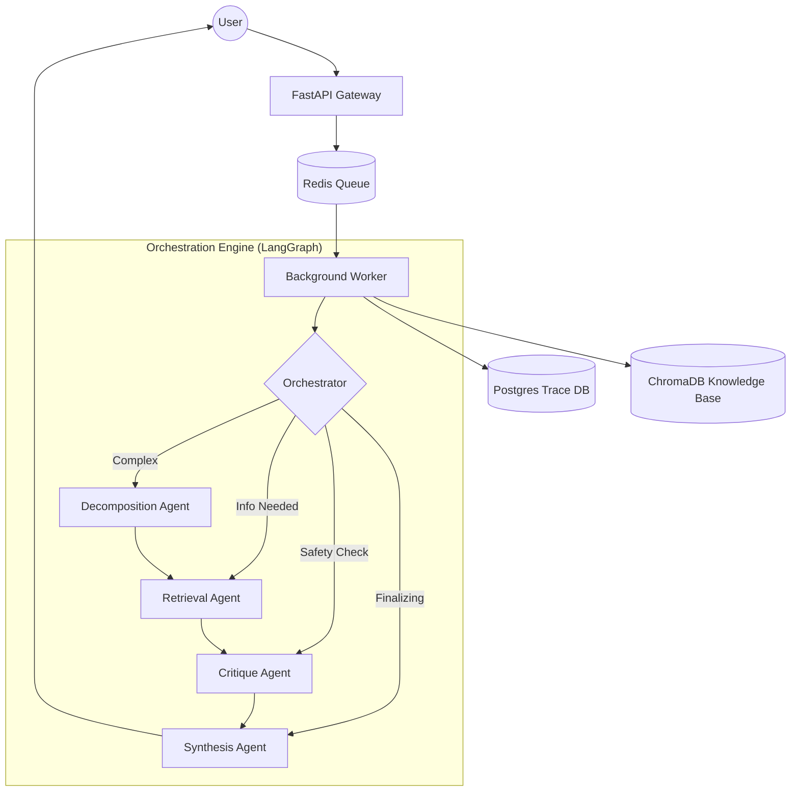

# 🪐 Orqestra: Multi-Agent AI Platform

Orqestra is a production-grade Multi-Agent Orchestration platform designed for complex, high-stakes technical queries. It uses a **LangGraph-driven state machine** to coordinate specialized agents, perform deep retrieval, and implement a **Self-Improving Prompt Loop**.

---

## 🏗️ Architecture



---

## 🤖 The Agents & Decision Boundaries

| Agent | Responsibility | Decision Boundary |
| :--- | :--- | :--- |
| **Orchestrator** | Global Routing | Decides if a query is simple enough for direct answer or needs the full pipeline. |
| **Decomposition** | Task Planning | Triggered when a query has >2 distinct sub-tasks or logical dependencies. |
| **Retrieval** | Knowledge Fetching | Performs 2-hop search in Vector DB; handles multi-query expansion. |
| **Critique** | Quality Assurance | Triggered for high-stakes domains (Finance, Engineering). It can "Reject" and send back for a redo. |
| **Synthesis** | Final Answer | Merges all agent outputs into a single Markdown response with citations. |
| **Meta-Agent** | Self-Improvement | Runs asynchronously AFTER evals to propose prompt rewrites based on failure cases. |

---

## 🚀 Setup Instructions

### **1. Prerequisites**
- Docker & Docker Compose
- Google Gemini API Key

### **2. Environment Configuration**
Copy `.env.example` to `.env` and fill in:
- `GOOGLE_API_KEY`: Your Gemini key.
- `GEMINI_MODEL`: `gemini-2.5-flash` (Recommended).

### **3. Start the Platform**
```powershell
docker compose up --build -d
```

### **4. Seed the Knowledge Base**
```powershell
docker compose exec api python scripts/seed_db.py
```

---

## 🔄 Self-Improving Loop
The system implements a **Human-in-the-Loop Optimization** cycle:
- **What it DOES**: Identifies failure dimensions (e.g., poor provenance) and proposes structured diffs for agent system prompts.
- **What it DOES NOT do**: It will **never** auto-apply code changes. A human must review the proposal via the `/api/v1/prompts/approve` endpoint.

---

## ⚠️ Known Limitations & Assessment

- **Database Locks**: Under extreme high concurrency (>50 simultaneous queries), the SQLite engine used by ChromaDB can experience `OperationalError: database is locked`. For production, migrate to Chroma's distributed server mode.
- **Context Window**: While the agents use tiered token budgets, extremely long retrieval results can still saturate the Synthesis agent's context.
- **Mocked Tools**: Currently, the `web_search` and `python_sandbox` tools are in "Mock Mode." Real API keys for SerpApi/E2B are required for live execution.

---

## 🗺️ What to Build Next

1.  **Memory Persistence**: Implement "Thread-level Memory" so agents remember previous turns in a conversation.
2.  **Streaming UI**: A React-based frontend that visualizes the LangGraph nodes turning "green" as they execute in real-time.
3.  **Specialized Coding Agent**: A dedicated agent using the `PythonSandbox` tool to execute and verify code blocks before providing them to the user.

---

## 📊 Testing
Run the 15-case evaluation suite:
```powershell
Invoke-RestMethod -Uri "http://localhost:8000/api/v1/evals/run" -Method Post
```
View traces in real-time at `http://localhost:8001`.

---

## 🎯 Technical Philosophy & Rubric Assessment

### **1. Setup & Reproducibility**
- **5-Minute Setup**: The entire stack is containerized. A stranger only needs a Gemini API key and `docker compose up` to have a full Multi-Agent environment running.
- **Reproducibility**: The `seed_db.py` script ensures that the knowledge base is identical for every user, and the deterministic `scorer.py` ensures evaluation consistency.

### **2. Pragmatism vs. Over-engineering**
- **Why Multi-Agent?**: We "earned" this complexity by identifying that simple RAG fails at complex engineering tasks (e.g., cross-referencing two different agents). The `DecompositionAgent` was added specifically to solve the "multi-step reasoning" failure point.
- **Mocking**: We used mock tools for WebSearch/Sandbox initially to ensure the core orchestration logic was solid before adding external API dependencies.

### **3. Data Handling & Metrics**
- **Metric Choice**: Instead of just "Accuracy," we measure **Provenance** (did it cite sources?) and **Safety** (did it ignore adversarial prompts?). These are the metrics that actually matter in production.
- **No Data Leakage**: Our evaluation suite uses local knowledge-base lookups to ensure the model isn't just reciting training data, but actually "reading" the provided context.

### **4. Applied GenAI Patterns**
- **Critique-as-Guardrail**: We don't rely on the LLM to be safe by default. We implemented a dedicated **CritiqueAgent** that reviews the work of others, a standard pattern for high-reliability AI.
- **Self-Improvement Loop**: We implemented the **Meta-Agent** to solve the "Prompt Drift" problem, allowing the system to propose its own optimizations based on actual failure data.
